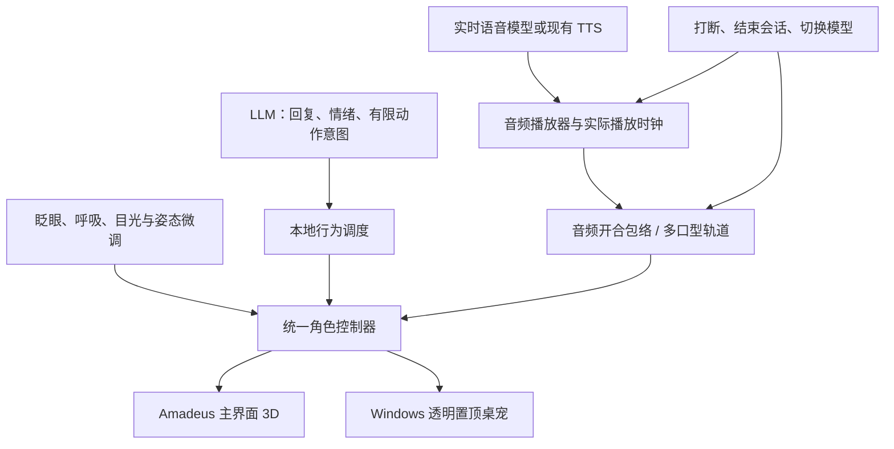

# 爱弥斯 Windows 桌面数字人计划

日期：2026-09-29

状态：计划，尚未实施数字人改造。

代码基线：`74b7c93`（已有实时语音、桌宠和 FormalASR 适配检查点）。

## 1. 目标与第一版体验

在 Amadeus 内，把现有爱弥斯 3D 桌宠做成能够自然听、说、回应的单角色数字人。

第一版用户体验：

1. 爱弥斯浮在 Windows 桌面最外层，透明、无边框，透明区域可以点击穿透。
2. 用户说话时，她有轻微注视和聆听姿态；等待回复时自然停留，不持续摇头。
3. 真正播出回复时，嘴部随声音开合；句中停顿会闭嘴，等待模型或等待音频时不会空说话。
4. 用户打断后，音频和嘴部动作一起停止，随后转为聆听。
5. 回复可以配合少量点头、侧头和说明手势，动作平滑收回。
6. 更细的多口型、说话表情和 Blender 动作片段在第二个可体验版本补齐。

本次工作范围是单角色桌面交互。ASR 模型选型研究暂时停止。旧三角色舞蹈、全曲渲染和头发/衣物力学分支继续保留原暂停状态。

## 2. 当前基础：已经核实的事实

| 项目 | 现状 | 对计划的影响 |
| --- | --- | --- |
| 运行资产 | `frontend/desktop/public/pet/aemeath.glb`，38,401,380 字节 | 可以沿用角色外观和骨架 |
| GLB 结构 | 1 个 mesh、44 个材质 primitive、1 个 skin、987 个 joints | 先测当前负载，再按实测优化 |
| 表情形变 | 仅 `にこり`、`まばたき`、`笑い`、`びっくり`、`あ`、`口` 六项 | 多音素口型需要扩充；`口` 的具体变形待可视检查 |
| 动画片段 | GLB 内 0 个 animation clip | 当前动作是程序生成，不能当成已经拥有完整动作库 |
| 嘴部控制 | 两个渲染入口均以 `sin(now * 17)` 驱动 `あ` | 只跟随 speaking 状态，缺乏声音和发音依据 |
| 已有轻动作 | 眨眼、呼吸、注视、招手、转身、移动、小舞动等 | 保留适合对话的动作，调整频率和混合方式 |
| 播放基础 | 实时语音有 24 kHz PCM 队列、AudioContext 播放时间、取消 epoch | 可直接扩展为口型时序来源 |
| 播放预缓冲 | 第一块 PCM 默认排队约 180 ms 后播放 | 收到数据或状态变成 speaking 都不能视为声音已经开始 |
| 角色入口 | 主界面 `Aemeath3D.tsx` 和透明桌宠 `pet.js` 各有控制代码 | 需共享控制逻辑，避免两边表现不一致 |
| 桌宠通信 | IPC 目前传状态、情绪、摘要、gesture | 需增加有界的音频表现数据和取消事件 |

相关代码：

- `frontend/desktop/src/components/Aemeath3D.tsx`
- `frontend/desktop/src/pet/pet.js`
- `frontend/desktop/src/services/realtimePlayback.ts`
- `frontend/desktop/src/services/liveVoiceWebSocket.ts`
- `frontend/desktop/src/services/liveVoice.ts`
- `frontend/desktop/src/pages/RealtimeAgent.tsx`
- `frontend/desktop/electron/main.ts`、`electron/pet-preload.ts`

已有导出说明将资产来源指向 `../Dance_Project/Wuthering_Waves_V9_AEMEATH_DYNAMIC_REVIEW.blend`，脚本为 `../Dance_Project/Aemeath_LLM_Demo/export_runtime.py`。该脚本只保留少数形变并关闭动画导出，因此应先检查原 Blender 文件里的完整表情，再决定哪些需要新做。

GLB 原始骨骼名与 Three.js 运行时名称可能不同：加载器会清理名称中的点号等字符。资产审计必须核对实际运行映射，不能仅凭 `腕.R` 与 `腕R` 的字面差异判断绑定失效。

## 3. 控制分工

- **LLM**：决定说什么，以及适合的情绪和有限动作意图，例如“微笑、点头、欢迎”。
- **本地控制器**：负责眨眼、呼吸、视线、平滑过渡、动作冷却和冲突处理。
- **口型系统**：跟随角色实际输出的音频，使用独立的连续时间轨道。
- **Blender**：制作和检查形变、骨架、动作片段，再导出运行资产。

模型只输出允许的高层动作，不逐帧生成骨骼角度。已有任务工具的执行与授权仍由 Amadeus 处理，实际工作状态可作为角色行为输入。

## 4. 实施阶段

### P0：确认资产与建立统一控制层

工作内容：

1. 只读检查源 Blender 文件的完整 shape keys、口腔、牙齿、舌头、眼睛与骨架；列出当前 GLB 导出时被裁掉的可复用表情。
2. 对现有六项形变逐个预览 0、0.5、1 权重，保存正面和侧面检查图；确认正常闭口、开口和微笑的范围。
3. 明确原始名、运行时名与语义名映射；缺失控制项产生开发诊断，避免静默失效。
4. 提取两处渲染器重复的角色控制逻辑，分开管理基础姿态、动作、表情和嘴部轨道。
5. 记录当前透明桌宠帧率和资源占用，作为比较基线。

产出：资产清单、表情预览、共享控制模块和映射表。

验收：当前外观、拖动、穿透和已有动作可复现；两处角色使用相同的表情定义。若需要编辑 Blender，保存到单独的数字人工作副本和新版本 GLB，保留原源文件及旧运行资产。

### P1：实际声音驱动的嘴部动作——首个可体验版本

工作内容：

1. 从**正在播放的角色输出音频**提取音量包络，平滑映射到已验证的开口形变。加入起音、收音、静音门限和上下限，避免颤嘴与长时间张嘴。
2. 以 `AudioContext.currentTime` 和已排定的 `source.start(playAt)` 为依据，处理缓冲、停顿、播放欠载与恢复；取消固定正弦开合。
3. 统一输出音频表现事件：会话/回复 ID、取消代数、计划播放时间、帧序号、口型权重、结束/取消。不同窗口之间显式换算并校准时钟，不假定各自 `performance.now()` 原点相同。
4. IPC 只发送限频、范围校验后的表现帧，不传原始长音频。渲染端在相邻帧之间插值；帧中断超时后平滑回闭口。
5. 播放器停止时同时撤销口型队列；旧回复迟到音频、字幕和口型均不能重新打开嘴。
6. 首先打通当前已部署的 Qwen/Gemini PCM 语音链路，覆盖主界面和桌宠。

音频入口安排：

| 音频来源 | 接入方法 |
| --- | --- |
| 已有实时 PCM | 扩展统一播放器，按真实播放时刻调度口型 |
| 服务端 TTS / 音频文件 | 从实际播放的音频节点读取包络，接入同一控制协议 |
| OpenAI WebRTC | 后续部署时从远端音轨获取分析数据，沿用同一角色控制器 |
| 浏览器 speechSynthesis | 当前没有统一 PCM 入口，只提供状态降级；精确口型演示使用可分析的音频路径 |

验收：声音未开始时闭口；句中静音自然闭口；用户打断后及时停口；麦克风输入不会直接驱动角色说话口型。

此阶段只验收音频驱动的自然张合，多音素发音准确度在 P2 验收。

### P2：Blender 多口型与说话表情

工作内容：

1. 优先复用源文件已有形变。补足中性闭口、A/I/U/E/O 类可见口型、M/B/P 闭唇、F 类唇齿和必要的嘴角变化；中文不同音素可共享视觉口型，不机械照搬拼音字母。
2. 检查最大开口、圆唇与闭唇时的上下唇、牙齿和口腔；缺少必要内口结构时补建，保持角色原有外观。
3. 定义语义化 morph 映射与安全权重，验证混合形态，尤其是微笑说话、惊讶说话与闭唇叠加。
4. 先用固定中文录音及离线对齐得到的口型轨道验证资产；再单独评估流式“音频到口型”方案的中文表现、延迟和 Windows 运行成本。
5. 音频提供商若返回可靠的音素时间戳，可直接接入；没有时间戳时采用经验证的音频推断。字幕字符等分只可做诊断，不能视为精确同步。
6. 加入共同发音的平滑过渡，防止每个音素之间机械切换。未通过实时预算时保留 P1 路径。

产出：版本化 Blender 工作文件、带完整口型映射的 GLB、固定录音的正面/侧面口型演示、运行适配器。

验收：闭唇、开口、圆唇有明显且自然的差异；正常说话时无明显穿唇、牙齿外露异常或表情冲突。选型只在独立样例通过后接入主程序。

### P3：增加少量高质量对话动作

第一批动作：

| 状态或意图 | 动作 |
| --- | --- |
| 待机 | 自然呼吸、间隔眨眼、偶尔移开视线再看回来 |
| 聆听 | 轻微前倾、保持注意、适量点头 |
| 思考 | 短暂侧看或侧头，随后稳定保持 |
| 肯定 / 否定 | 单次点头 / 摇头 |
| 欢迎 | 短招手及微笑 |
| 解释 | 小幅单手说明手势 |
| 疑惑 | 轻侧头与眉眼变化 |
| 完成任务 | 收回工作姿态，轻点头 |

为适合的动作制作 Blender animation clips，导出后与程序化微动作按身体区域混合。每个动作具有进入、保持、退出、优先级及冷却时间；被打断后平滑返回聆听，禁止不断重触发动作。

优先保持原地站立和上半身交流。桌面位移、长舞蹈与复杂步行待当前交流动作通过视觉验收后再规划。

### P4：统一配置、Windows 打包与体验验收

在 Amadeus 现有配置中增加：

- 口型模式：音频张合 / 多口型 / 关闭。
- 开口幅度、音画偏移校准、表情强度。
- 动作频率、注视/眨眼开关、低功耗帧率。
- 现有透明桌宠入口与角色位置设置。

开发调试信息放在独立诊断区域，不占用日常对话界面。完成后生成新的 Windows 包，在实际桌面上体验并录制受控样例。

## 5. 验收目标

以下均为未来目标，不是当前已达结果。

| 检查 | 目标与方法 |
| --- | --- |
| 声音与嘴部起止 | 固定录音重复 10 次，记录输出音频时刻与渲染时刻；P95 偏差目标 ≤100 ms，并用音画录屏复核 |
| 打断停口 | 以播放器实际清音为起点，150 ms 内恢复自然闭口；之后旧回复不得重新开口 |
| 连续稳定性 | 连续对话 10 分钟；覆盖快速打断、长句、句中停顿、网络缓冲、切换模型和断线重连 |
| 双窗口一致性 | 主面板与桌宠同步接收同一表现轨道；主窗口最小化后桌宠仍正常 |
| 形变质量 | 同一固定中文样例正面、侧面检查；正常/微笑/惊讶三类表情下检查闭唇与开口 |
| 动作自然度 | 每类动作进入和退出平滑；手势有冷却，眼睛、头部、身体和嘴部互不覆盖 |
| 性能 | 用户当前电脑桌宠持续 ≥30 FPS；记录帧时间、CPU/GPU 占用和新增口型计算开销 |
| Windows 形态 | 透明无边框、置顶、鼠标穿透、拖动、托盘开关继续正常 |

必要自动化回归聚焦：播放队列与口型队列共同取消、旧 epoch 丢弃、静音闭口、时间换算和动作优先级。角色好看与否必须以实际画面验收。

## 6. 交付顺序

2026-09-29 用户明确改为先在 Blender 中打通流程，交付顺序据此调整：

1. **Blender 工作样片（本轮已实现）**：检查完整口型；独立工作副本；固定语音与原生关键帧；正面与斜侧面预览；普通 Blender 独立重开验证。详见 `assets/digital_human/aemeath/v03/README.md`。当前为本地合成测试音、近似口型，未连接实时服务。
2. **运行时 P0 + P1（首版已接入）**：新 GLB、音频时钟驱动口型、主界面／透明桌宠同步、停止闭口、试听与 Windows 目录包；真实 Gemini 返回音频已验证。见 `doc/reports/2026-09-29-digital-human-amadeus-integration.md`。长时间稳定性与其他提供商实际调用仍未在本轮全覆盖。
3. **完善 P2**：校准中文口型映射，评估实时音素方案，验证表情叠加。
4. **P3 + P4**：对话动作与表情组合、配置、稳定性验证及 Windows 包。

每个阶段保留上一版资产及验证证据。Blender 样片完成不代表运行时延迟、10 分钟对话稳定性或 Windows 包已验收。
